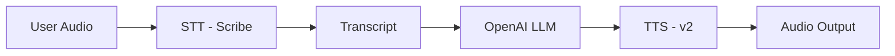

import { MaximPlayer } from "/snippets/maximPlayer.mdx"

This tutorial demonstrates how to build a complete voice agent pipeline that converts speech to text, processes it with an LLM, and generates speech output. The entire pipeline is traced end-to-end using Maxim for full observability.
The agent uses Elevenlabs' transcription and synthesis capabilities with an external LLM to generate the response.

<MaximPlayer url="https://drive.google.com/file/d/176sV7qrKrzBhgGSChTdni7_G4TdnXiN6/preview" />

## Prerequisites
- Python 3.9+
- ElevenLabs API key
- OpenAI API key
- Maxim account (API key, log repo ID)
- Sample audio file for testing *(optional)*

## Project Setup

Configure your environment variables in `.env`:

```.env
EL_API_KEY=your_elevenlabs_api_key
OPENAI_API_KEY=your_openai_api_key
MAXIM_API_KEY=your_maxim_api_key
MAXIM_LOG_REPO_ID=your_maxim_log_repo_id
```

## Install Dependencies

```bash
pip install -r requirements.txt
```

## Add Dependencies to requirements.txt

```text
elevenlabs>=1.0.0
openai>=1.0.0
maxim-py>=3.9.0
python-dotenv>=1.1.0
```

## Set Up a Virtual Environment

```bash
python3 -m venv venv
source venv/bin/activate
```

## Create a Project Directory and Navigate into It

```bash
mkdir elevenlabs_voice_agent
cd elevenlabs_voice_agent
```

---

## Code Walkthrough: Key Components

Below, each section of the code is presented with a technical explanation.

### 1. Imports and Configuration

```python
import os
from uuid import uuid4

from dotenv import load_dotenv
from elevenlabs.play import play
from elevenlabs.client import ElevenLabs
from elevenlabs.core import RequestOptions
from openai import OpenAI

from maxim import Maxim
from maxim.logger.components.trace import TraceConfigDict
from maxim.logger.elevenlabs import instrument_elevenlabs
from maxim.logger.openai import MaximOpenAIClient

load_dotenv()

# Configuration
ELEVENLABS_API_KEY = os.getenv("EL_API_KEY")
OPENAI_API_KEY = os.getenv("OPENAI_API_KEY")

if not ELEVENLABS_API_KEY:
    raise ValueError("ELEVENLABS_API_KEY environment variable is not set")

if not OPENAI_API_KEY:
    raise ValueError("OPENAI_API_KEY environment variable is not set")
```

- Imports ElevenLabs SDK for STT and TTS operations.
- Imports Maxim instrumentation utilities for automatic tracing.
- Loads and validates environment variables to ensure all required API keys are present.

---

### 2. Initialize Maxim Logger and Instrument ElevenLabs

```python
# Initialize Maxim logger
# This automatically picks up MAXIM_API_KEY and MAXIM_LOG_REPO_ID from environment variables
logger = Maxim().logger()

# Instrument ElevenLabs STT/TTS methods
instrument_elevenlabs(logger)

# Initialize ElevenLabs client
elevenlabs_client = ElevenLabs(api_key=ELEVENLABS_API_KEY)

# Initialize OpenAI client with Maxim integration
openai_client = MaximOpenAIClient(
    client=OpenAI(api_key=OPENAI_API_KEY),
    logger=logger
)
```

- Creates a Maxim logger instance that automatically reads credentials from environment variables.
- `instrument_elevenlabs` patches ElevenLabs SDK methods to automatically capture STT and TTS operations as spans.
- `MaximOpenAIClient` wraps the OpenAI client to trace LLM calls within the same trace context.

<Note>The OpenAI integration is used to demonstrate how to trace LLM calls with Maxim in addition to ElevenLabs. You can use any other LLM provider you want.</Note>

---

### 3. OpenAI LLM Call with Trace Linking

```python
def call_openai_llm(transcript: str, trace_id: str) -> str:
    """
    Call OpenAI LLM to generate a response based on the user's transcript.
    Uses the same trace ID to link the LLM call with the STT-TTS pipeline.
    """
    messages = [
        {"role": "system", "content": "You are a helpful assistant. Respond concisely and naturally."},
        {"role": "user", "content": transcript},
    ]

    # Create a chat completion request with trace ID in extra_headers
    response = openai_client.chat.completions.create(
        model="gpt-4o-mini",
        messages=messages,
        extra_headers={
            "x-maxim-trace-id": trace_id
        }
    )

    # Extract response text
    response_text = response.choices[0].message.content
    return response_text
```

- Sends the transcribed text to OpenAI's GPT-4o-mini model for processing.
- Uses `x-maxim-trace-id` header to link this LLM call to the same trace as STT and TTS operations.
- Returns the generated response text for TTS conversion.

---

### 4. STT-LLM-TTS Pipeline Agent

```python
def stt_tts_pipeline_agent():
    """
    A simple agent that demonstrates the STT-LLM-TTS pipeline with unified tracing.

    Flow:
    1. User provides audio input (speech)
    2. STT converts audio to text (transcript) - instrumented, sets trace input
    3. OpenAI LLM processes the transcript and generates a response - uses same trace ID
    4. TTS converts LLM response text to audio - instrumented, sets trace output
    5. Audio is returned as output
    """

    # Create a shared trace ID for the entire pipeline
    trace_id = str(uuid4())

    trace = logger.trace(
        TraceConfigDict(
            id=trace_id,
            name="STT-OpenAI-TTS Pipeline Agent",
            tags={"provider": "elevenlabs+openai", "operation": "pipeline"},
        )
    )

    # Create request options with trace_id header for both STT and TTS
    request_options = RequestOptions(
        additional_headers={
            "x-maxim-trace-id": trace_id
        }
    )

    print("=== STT-OpenAI-TTS Pipeline Agent ===")
    print(f"Trace ID: {trace_id}")
```

- Generates a unique trace ID to correlate all operations in the pipeline.
- Creates a Maxim trace with descriptive name and tags for easy filtering.
- Configures `RequestOptions` with the trace ID header for ElevenLabs API calls.

---

### 5. Speech-to-Text Conversion

```python
    audio_file_path = os.path.join(
        os.path.dirname(__file__),
        "files",
        "sample_audio.wav"
    )

    if os.path.exists(audio_file_path):
        print(f"Processing audio file: {audio_file_path}")

        # Convert speech to text
        with open(audio_file_path, "rb") as audio_file:
            transcript = elevenlabs_client.speech_to_text.convert(
                file=audio_file,
                model_id="scribe_v1",
                request_options=request_options
            )

        # Extract transcript text from the result object
        transcript_text = ""
        if isinstance(transcript, str):
            transcript_text = transcript
        elif hasattr(transcript, "text"):
            transcript_text = transcript.text
        elif isinstance(transcript, dict) and "text" in transcript:
            transcript_text = transcript["text"]
        else:
            transcript_text = str(transcript)

        print(f"Transcript: {transcript_text}")
```

- Reads the audio file and sends it to ElevenLabs Scribe STT model.
- The `request_options` automatically links this operation to the trace.
- Handles multiple response formats for robust transcript extraction.

---

### 6. Text-to-Speech Conversion

```python
        # OpenAI LLM processing
        print("\n=== OpenAI LLM Processing ===")
        response_text = call_openai_llm(transcript_text, trace_id)
        print(f"LLM Response: {response_text}")

        # Text-to-Speech
        print("\n=== Text-to-Speech ===")

        # Convert LLM response text to speech
        audio_output = elevenlabs_client.text_to_speech.convert(
            text=response_text,
            voice_id="JBFqnCBsd6RMkjVDRZzb",
            model_id="eleven_multilingual_v2",
            output_format="mp3_44100_128",
            request_options=request_options
        )

        play(audio_output)
```

- Passes the transcript to the OpenAI LLM for response generation.
- Converts the LLM response to speech using ElevenLabs multilingual TTS model.
- Uses the same `request_options` to maintain trace continuity.
- Plays the generated audio output.

---

### 7. Fallback for Missing Audio File

```python
    else:
        print(f"Sample audio file not found at {audio_file_path}")
        print("Creating a simple STT-LLM-TTS example instead...")

        # Create a dummy transcript for testing
        dummy_transcript = "Hello, how are you?"
        print(f"Using dummy transcript: {dummy_transcript}")

        # Set trace input to the transcript
        trace.set_input(dummy_transcript)

        # OpenAI LLM processing
        response_text = call_openai_llm(dummy_transcript, trace_id)
        print(f"LLM Response: {response_text}")

        # Text-to-Speech only
        audio_output = elevenlabs_client.text_to_speech.convert(
            text=response_text,
            voice_id="JBFqnCBsd6RMkjVDRZzb",
            model_id="eleven_multilingual_v2",
            output_format="mp3_44100_128",
            request_options=request_options
        )

    trace.end()
```

- Provides a fallback when no audio file is available for testing.
- Manually sets the trace input using `trace.set_input()`.
- Demonstrates that the TTS portion works independently of STT.

---

### 8. Main Block

```python
if __name__ == "__main__":
    try:
        stt_tts_pipeline_agent()
    finally:
        logger.cleanup()
```

Entry point for the script. Ensures the logger is properly cleaned up after execution to flush all traces.

---

## Pipeline Flow

The agent implements a complete voice interaction pipeline:



All operations are traced under a single trace ID for unified observability.

---

## How to Use

1. **Configure credentials**: Set all API keys in your `.env` file.
2. **Prepare audio** (optional): Place a `sample_audio.wav` file in a `files/` subdirectory.
3. **Run the agent**: Execute the script to process audio through the pipeline.
4. **Monitor in Maxim**: View the complete trace including STT, LLM, and TTS spans.

## Run the Script

```bash
python elevenlabs_agent.py

# or if you are using uv for dependency management

uv sync
uv run elevenlabs_agent.py
```

## Observability with Maxim

The instrumentation provides comprehensive tracing data:

- **Unified traces**: All STT, LLM, and TTS operations linked under one trace ID
- **Input/Output capture**: Audio files attached to STT spans, text captured for LLM and TTS
- **Timing metrics**: Latency measurements for each pipeline stage
- **Custom tags**: Filter traces by provider and operation type
- **Error tracking**: Automatic capture of failures at any pipeline stage

## Troubleshooting

- **No traces in Maxim**
  - Verify `MAXIM_API_KEY` and `MAXIM_LOG_REPO_ID` are set correctly
  - Ensure `logger.cleanup()` is called before the process exits
  - Check that `instrument_elevenlabs(logger)` is called before creating the ElevenLabs client

- **STT not working**
  - Confirm `EL_API_KEY` is valid
  - Ensure audio file is in a supported format (WAV, MP3, etc.)
  - Check file path is correct

- **LLM response empty**
  - Verify `OPENAI_API_KEY` is set correctly
  - Check that the transcript was successfully extracted

- **TTS not producing audio**
  - Confirm the voice ID is valid (use ElevenLabs dashboard to find available voices)
  - Check that the model ID is correct

- **Trace operations not linked**
  - Ensure the same `trace_id` is passed to all operations
  - Verify `x-maxim-trace-id` header is included in request options

---

## Complete Code: elevenlabs_agent.py

```python
"""Example agent using ElevenLabs STT-TTS pipeline with OpenAI LLM and Maxim tracing."""

import os
from uuid import uuid4

from dotenv import load_dotenv
from elevenlabs.play import play
from elevenlabs.client import ElevenLabs
from elevenlabs.core import RequestOptions
from openai import OpenAI

from maxim import Maxim
from maxim.logger.components.trace import TraceConfigDict
from maxim.logger.elevenlabs import instrument_elevenlabs
from maxim.logger.openai import MaximOpenAIClient


load_dotenv()

# Configuration
ELEVENLABS_API_KEY = os.getenv("EL_API_KEY")
OPENAI_API_KEY = os.getenv("OPENAI_API_KEY")

if not ELEVENLABS_API_KEY:
    raise ValueError("ELEVENLABS_API_KEY environment variable is not set")

if not OPENAI_API_KEY:
    raise ValueError("OPENAI_API_KEY environment variable is not set")

# Initialize Maxim logger
# This automatically picks up MAXIM_API_KEY and MAXIM_LOG_REPO_ID from environment variables
logger = Maxim().logger()

# Instrument ElevenLabs STT/TTS methods
instrument_elevenlabs(logger)

# Initialize ElevenLabs client
elevenlabs_client = ElevenLabs(api_key=ELEVENLABS_API_KEY)

# Initialize OpenAI client with Maxim integration
openai_client = MaximOpenAIClient(
    client=OpenAI(api_key=OPENAI_API_KEY),
    logger=logger
)


def call_openai_llm(transcript: str, trace_id: str) -> str:
    """
    Call OpenAI LLM to generate a response based on the user's transcript.
    Uses the same trace ID to link the LLM call with the STT-TTS pipeline.
    """
    messages = [
        {"role": "system", "content": "You are a helpful assistant. Respond concisely and naturally."},
        {"role": "user", "content": transcript},
    ]

    # Create a chat completion request with trace ID in extra_headers
    response = openai_client.chat.completions.create(
        model="gpt-4o-mini",
        messages=messages,
        extra_headers={
            "x-maxim-trace-id": trace_id
        }
    )

    # Extract response text
    response_text = response.choices[0].message.content
    return response_text


def stt_tts_pipeline_agent():
    """
    A simple agent that demonstrates the STT-LLM-TTS pipeline with unified tracing.

    Flow:
    1. User provides audio input (speech)
    2. STT converts audio to text (transcript) - instrumented, sets trace input
    3. OpenAI LLM processes the transcript and generates a response - uses same trace ID
    4. TTS converts LLM response text to audio - instrumented, sets trace output
    5. Audio is returned as output

    All operations (STT, LLM, TTS) are traced under a single trace via instrumentation.
    The trace input is the user's speech transcript, and the output is the LLM response text.
    Both user speech and assistant speech audio files are attached to the trace.
    """

    # Create a shared trace ID for the entire pipeline
    trace_id = str(uuid4())

    trace = logger.trace(
        TraceConfigDict(
            id=trace_id,
            name="STT-OpenAI-TTS Pipeline Agent",
            tags={"provider": "elevenlabs+openai", "operation": "pipeline"},
        )
    )

    # Create request options with trace_id header for both STT and TTS
    request_options = RequestOptions(
        additional_headers={
            "x-maxim-trace-id": trace_id
        }
    )

    print("=== STT-OpenAI-TTS Pipeline Agent ===")
    print(f"Trace ID: {trace_id}")

    audio_file_path = os.path.join(
        os.path.dirname(__file__),
        "files",
        "sample_audio.wav"
    )

    # Check if sample file exists, otherwise create a dummy scenario
    if os.path.exists(audio_file_path):
        print(f"Processing audio file: {audio_file_path}")

        # Convert speech to text
        # This will add to the existing trace (trace_id from request_options)
        # - Input: audio attachment (speech)
        # - Output: transcript text
        with open(audio_file_path, "rb") as audio_file:
            transcript = elevenlabs_client.speech_to_text.convert(
                file=audio_file,
                model_id="scribe_v1",
                request_options=request_options
            )

        # Extract transcript text from the result object
        transcript_text = ""
        if isinstance(transcript, str):
            transcript_text = transcript
        elif hasattr(transcript, "text"):
            transcript_text = transcript.text
        elif isinstance(transcript, dict) and "text" in transcript:
            transcript_text = transcript["text"]
        else:
            transcript_text = str(transcript)

        print(f"Transcript: {transcript_text}")

        # OpenAI LLM processing
        print("\n=== OpenAI LLM Processing ===")
        response_text = call_openai_llm(transcript_text, trace_id)
        print(f"LLM Response: {response_text}")

        # Text-to-Speech
        print("\n=== Text-to-Speech ===")

        # Convert LLM response text to speech
        # This will also add to the same trace (trace_id from request_options)
        # - Input: LLM response text (already set as trace output above)
        # - Output: audio attachment (assistant speech)
        audio_output = elevenlabs_client.text_to_speech.convert(
            text=response_text,
            voice_id="JBFqnCBsd6RMkjVDRZzb",
            model_id="eleven_multilingual_v2",
            output_format="mp3_44100_128",
            request_options=request_options
        )

        play(audio_output)
    else:
        print(f"Sample audio file not found at {audio_file_path}")
        print("Creating a simple STT-LLM-TTS example instead...")

        # Create a dummy transcript for testing
        dummy_transcript = "Hello, how are you?"
        print(f"Using dummy transcript: {dummy_transcript}")

        # Set trace input to the transcript
        trace.set_input(dummy_transcript)

        # OpenAI LLM processing
        print("\n=== OpenAI LLM Processing ===")
        response_text = call_openai_llm(dummy_transcript, trace_id)
        print(f"LLM Response: {response_text}")

        # Text-to-Speech
        print("\n=== Text-to-Speech ===")

        audio_output = elevenlabs_client.text_to_speech.convert(
            text=response_text,
            voice_id="JBFqnCBsd6RMkjVDRZzb",
            model_id="eleven_multilingual_v2",
            output_format="mp3_44100_128",
            request_options=request_options
        )

    trace.end()


if __name__ == "__main__":
    try:
        stt_tts_pipeline_agent()
    finally:
        logger.cleanup()
```

## Resources

<CardGroup cols="1">
    <Card title="Cookbook Code" icon="github" href="https://github.com/maximhq/maxim-cookbooks/blob/main/python/observability-online-eval/eleven-labs/stt_tts_pipeline_with_openai.py">
        Python Code for ElevenLabs & Maxim
    </Card>
    <Card title="ElevenLabs Documentation" icon="book" href="https://elevenlabs.io/docs">
        Learn more about ElevenLabs STT and TTS
    </Card>
</CardGroup>

