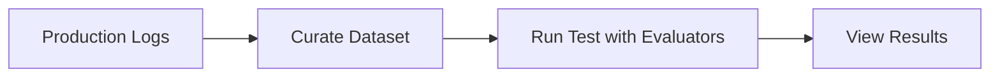

## What are offline evals via logs?

Offline evaluation via logs allows you to run evaluators on data captured from your AI applications without re-running inference. This is useful for:

- **Testing new evaluators** on historical production data before deploying them
- **Retroactive analysis** of past interactions with new evaluation criteria
- **Comparing model versions** by evaluating outputs from different deployments
- **Quality audits** on specific time periods or user segments

## How it works

The workflow consists of three main steps:

1. **Capture logs** - Use the Maxim SDK to log traces from your production AI application
2. **Curate a dataset** - Export logs or create a dataset from the Log Repository
3. **Run a test** - Execute a test run using the curated dataset with your evaluators



## Prerequisites

Before getting started, ensure you have:

- Logs captured in a [Log Repository](/tracing/overview)
- The [Maxim SDK](/sdk/overview) installed in your environment
- Evaluators configured in your workspace

## Step 1: Capture Logs

If you haven't already, integrate the Maxim SDK into your application to capture logs. See the [Tracing Quickstart](/tracing/quickstart) for setup instructions.

<CodeGroup>
```python Python
from maxim import Maxim
from maxim.logger import LoggerConfig

# Initialize Maxim with logging
maxim = Maxim({
    "api_key": "your-api-key",
})

logger = maxim.logger(LoggerConfig(id="your-log-repository-id"))

# Your application code
trace = logger.trace(id="unique-trace-id", name="User Query")

# Log a generation
generation = trace.generation(
    id="gen-1",
    name="LLM Call",
    model="gpt-4o",
    provider="openai",
    messages=[{"role": "user", "content": user_input}],
)

# ... your LLM call ...

generation.result(response)
trace.end()
```

```typescript JS/TS
import { Maxim } from '@maximai/maxim-js';

// Initialize Maxim with logging
const maxim = new Maxim({
  apiKey: 'your-api-key',
});

const logger = await maxim.logger({ id: 'your-log-repository-id' });

// Your application code
const trace = logger.trace({
  id: 'unique-trace-id',
  name: 'User Query',
});

// Log a generation
const generation = trace.generation({
  id: 'gen-1',
  name: 'LLM Call',
  model: 'gpt-4o',
  provider: 'openai',
  messages: [{ role: 'user', content: userInput }],
});

// ... your LLM call ...

generation.result(response);
trace.end();
```
</CodeGroup>

## Step 2: Curate a Dataset from Logs

Once you have logs in your repository, you can curate them into a dataset for evaluation. There are two approaches:

### Option A: Via the UI

1. Navigate to your Log Repository in the Maxim dashboard
2. Use filters to select the logs you want to evaluate
3. Click **Add to Dataset** and map the columns
4. Save the dataset

See [Dataset Curation](/library/datasets/curate-datasets) for detailed instructions.

### Option B: Export and Load Programmatically

Export logs from the dashboard and load them as a local dataset:

<CodeGroup>
```python Python
import json

# Load exported logs
with open("exported_logs.json", "r") as f:
    logs = json.load(f)

# Transform to dataset format
dataset = [
    {
        "input": log["input"],
        "output": log["output"],
        "expected_output": log.get("expected_output", ""),
    }
    for log in logs
]
```

```typescript JS/TS
import fs from 'fs';

// Load exported logs
const logs = JSON.parse(fs.readFileSync('exported_logs.json', 'utf-8'));

// Transform to dataset format
const dataset = logs.map((log: any) => ({
  input: log.input,
  output: log.output,
  expectedOutput: log.expectedOutput || '',
}));
```
</CodeGroup>

## Step 3: Run a Test

Now run a test using your curated dataset. Since the logs already contain outputs, use `yields_output` to return the existing output instead of calling an LLM.

<CodeGroup>
```python Python
from maxim import Maxim
from maxim.models import LocalData, YieldedOutput

maxim = Maxim({"api_key": "your-api-key"})

# Your curated dataset (from logs)
dataset = [
    {"input": "What is AI?", "output": "AI is artificial intelligence..."},
    {"input": "Explain ML", "output": "Machine learning is..."},
]

def replay_output(data: LocalData) -> YieldedOutput:
    """Return the existing output from the log - no LLM call needed."""
    return YieldedOutput(data=data.get("Output") or data.get("output") or "")

result = (
    maxim.create_test_run(
        name="Eval on Historical Logs",
        in_workspace_id="your-workspace-id"
    )
    .with_data(dataset)
    .with_data_structure({
        "input": "INPUT",
        "output": "OUTPUT",
    })
    .yields_output(replay_output)
    .with_evaluators("Clarity", "Bias", "Output Relevance")
    .run()
)

print(f"View results: {result.test_run_result.link}")
```

```typescript JS/TS
import { Maxim, type Data, type YieldedOutput } from '@maximai/maxim-js';

const maxim = new Maxim({ apiKey: 'your-api-key' });

// Your curated dataset (from logs)
const dataset: Data[] = [
  { input: 'What is AI?', output: 'AI is artificial intelligence...' },
  { input: 'Explain ML', output: 'Machine learning is...' },
];

function replayOutput(data: Data): YieldedOutput {
  // Return the existing output from the log - no LLM call needed
  return { data: data.output || '' };
}

const result = await maxim
  .createTestRun('Eval on Historical Logs', 'your-workspace-id')
  .withData(dataset)
  .withDataStructure({
    input: 'INPUT',
    output: 'OUTPUT',
  })
  .yieldsOutput(replayOutput)
  .withEvaluators('Clarity', 'Bias', 'Output Relevance')
  .run();

console.log(`View results: ${result.testRunResult.link}`);
```
</CodeGroup>

<Note>
When using `yields_output` with historical logs, you're simply returning the pre-recorded output for evaluation. No LLM inference is performed, saving costs and time.
</Note>

## Using a Hosted Dataset

If you created a dataset in the Maxim UI, pass the dataset ID directly:

<CodeGroup>
```python Python
result = (
    maxim.create_test_run(
        name="Eval on Curated Dataset",
        in_workspace_id="your-workspace-id"
    )
    .with_data("your-dataset-id")  # Dataset ID from Maxim
    .yields_output(replay_output)
    .with_evaluators("Clarity", "Bias")
    .run()
)
```

```typescript JS/TS
const result = await maxim
  .createTestRun('Eval on Curated Dataset', 'your-workspace-id')
  .withData('your-dataset-id') // Dataset ID from Maxim
  .yieldsOutput(replayOutput)
  .withEvaluators('Clarity', 'Bias')
  .run();
```
</CodeGroup>

## Best Practices

1. **Filter logs strategically** - Use tags, time ranges, or error filters to create focused datasets
2. **Include context** - If your logs have retrieved context (RAG), pass it via `retrieved_context_to_evaluate` for evaluators like Faithfulness
3. **Version your datasets** - Create separate datasets for different time periods or experiments
4. **Compare evaluators** - Test new evaluation criteria on historical data before deploying them to production

## Next Steps

- [Dataset Curation](/library/datasets/curate-datasets) - Learn more about creating datasets from logs
- [Custom Evaluators](/library/evaluators/custom-evaluators) - Create evaluators for your specific use cases
- [Online Evals](/online-evals/overview) - Set up real-time evaluation on incoming logs

<Note>[Schedule a demo](https://getmaxim.ai/demo) to see how Maxim AI helps teams ship reliable agents 5x faster</Note>
